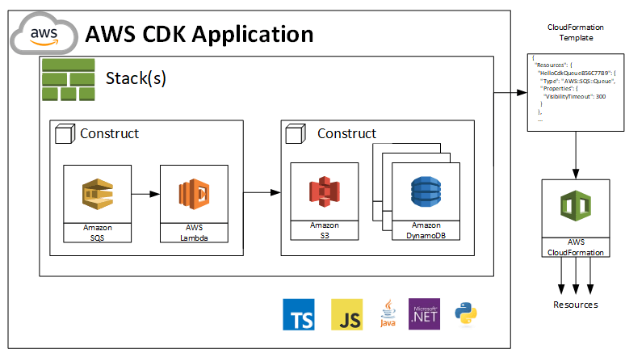
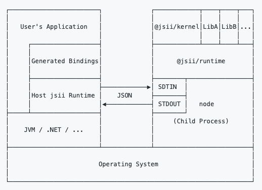

<!-- .slide: data-background="images/background/aws-cdk-ga.jpg" -->

<!--horizontal_slide-->

<!-- .slide: data-background="white" -->


Note: Die Immowelt Hamburg GmbH gehört mit der Immowelt AG zur Immowelt Gruppe,
einer 100%igen Axel Springer Tochter.
Wir arbeiten als Spezialisten für die digitale Immobilienvermarktung an der Weiterentwicklung der reichweitenstarken Immobilienportale immonet.de und immowelt.de,
und erschaffen zurzeit die nächste Plattform-Generation. Darüber hinaus betreibt Immowelt Portale wie bauen.de und umzugsauktion.de und bietet eine CRM-Software für die Immobilienwirtschaft an.

Wir suchen motivierte, erfahrene und talentierte Mitarbeiter, die an die Chancen von Cloud Computing, Data Science und Mobile Apps glauben und neuartige Technologien verwenden und mitgestalten wollen.
Im Umfeld der AVIV Gruppe als habt Ihr auch die Chance, international mitzuarbeiten.

Englisch

Immowelt Hamburg together with Immowelt Corp. is part of Immowelt Group, a 100% affiliate of Axel Springer.
As specialists for the digital real estate marketing we are working on the advancement of the wide-coverage real estate portal immonet.de and immowelt.de, and are currently creating the next generation platform.
Beyond that Immowelt runs portals like bauen.de and umzugsauktion.de,
and offers a CRM software for the real estate industry.

We are looking for motivated, experienced and talented employees believing in the odds of
cloud computing, data science and mobile apps, and want to use and help shape new technologies.
In context of the AVIV group you also have the chance to work internationally.

<!--vertical_slide-->

<!-- .slide: data-background="white" -->


https://bit.ly/387MHF0

Our Tech Stack:

https://stackshare.io/immowelt-group/immowelt-hamburg-gmbh

<!--horizontal_slide-->

## Agenda

* Warum Infrastruktur mit Code? <!-- .element: class="fragment" -->
* Was gibt es bereits für AWS? <!-- .element: class="fragment" -->
* Prinzip, Lifecycle, Projektaufbau <!-- .element: class="fragment" -->
* Setup, Demos <!-- .element: class="fragment" -->
* Testing, Continuous Integration <!-- .element: class="fragment" -->
* Learnings <!-- .element: class="fragment" -->
* Weitere Werkzeuge <!-- .element: class="fragment" -->
* Construct Library <!-- .element: class="fragment" -->
* Ausblick <!-- .element: class="fragment" -->

<!--horizontal_slide-->

## Infrastructure

Warum Infrastruktur <del>as</del> with Code?

* Cloud App + Infrastruktur in bevorzugter Sprache <!-- .element: class="fragment" -->
* Hohe Abstraktion vermeidet wachsende Deskriptoren mit steigender Komplexität <!-- .element: class="fragment" -->
* Keine markup-artiges Yaml, Json or low-level provider-spezifische Template Sprache <!-- .element: class="fragment" -->
* Geringere Wahrscheinlichkeit von Kopien statt Wiederverwendung (komplexer Infrastruktur) <!-- .element: class="fragment" -->
* AWS Cross Region Bedarf für eine Anwendung mit Logik und Multi-Stacks einfach zu decken <!-- .element: class="fragment" -->

Note: Intention, Thoughtworks Tech Radar notes about handwritten Cfn, Terraform HCL 2.0 multi cloud provider fähig, Modularisierungskonzepte übertragbar, vermeidet Architektur-Fehler wie De-Isolation und operative Zentralisierung (Z.B. alle Zertifikate zentral verwaltet, Feature-Team hat keine Hoheit)

<!--vertical_slide-->

## Weitere Vorteile (AWS CDK)

* Logik (if, for-loops etc.) zur Infrastrukturdefinition <!-- .element: class="fragment" -->
* Objektorientierte Techniken zur Modellierung <!-- .element: class="fragment" -->
* Teilen und Wiederverwenden von Komponenten/Bibliotheken  <!-- .element: class="fragment" -->
* Organisation von Projekten in logisch-fachliche Module  <!-- .element: class="fragment" -->
* Testing von Infrastruktur-Code mit Standardmittel  <!-- .element: class="fragment" -->
* Bestehende Code Review Workflows nutzbar  <!-- .element: class="fragment" -->
* Code Completion in der IDE  <!-- .element: class="fragment" -->

<!--vertical_slide-->

## (Mögliche) Nachteile

* Neues SDK/API, ggf. mit unvollständiger Abdeckung des Cloud Ressourcen. <!-- .element: class="fragment" -->
* Modularisierungskonzepte eventuell nicht übertragbar. <!-- .element: class="fragment" -->
* Development Kit nicht auf andere Provider übertragbar. <!-- .element: class="fragment" -->
* Akzeptanz bei versierten Terraformern und Serverless/SAM Nutzern (DevOps) <!-- .element: class="fragment" -->

<!--horizontal_slide-->


Note: Erwartung und AWS Angebote

<!--horizontal_slide-->

## Werkzeuge

Was gibt es bereits für AWS?

* Pulumi (multi cloud)
* Troposhere
* Sceptre
* Cfn Modules
* ...

Note: From Troposphere to Pulumi, Python-based tools, Cfn modularizers, multi-cloud tools

<!--vertical_slide-->


<!--horizontal_slide-->

Was ist AWS CDK?

* AWS Cloud Development Kit ist ein Open-Source-Framework für die Softwareentwicklung <!-- .element: class="fragment" -->
* Damit wird Cloud-Infrastruktur als Code mit modernen Programmiersprachen definiert und über AWS Cloudformation bereitgestellt <!-- .element: class="fragment" -->
* Unterstütze Sprachen: TypeScript, JavaScript, Python, Java, and C#/.Net <!-- .element: class="fragment" -->
* Entwickler erstellen in ihrer Sprache wiederverwendbare Komponenten (Constructs) und führen sie in Stacks und Apps zusammen <!-- .element: class="fragment" -->

<!--horizontal_slide-->

## Funktionsprinzip


<!--vertical_slide-->

Erwartete Qualität & AWS Abdeckung


<!--vertical_slide-->

Aktueller Zustand (stabil) & Abdeckung (teilweise)


<!--horizontal_slide-->

## Lebenszyklus


<!--horizontal_slide-->

## Projektaufbau



<!--vertical_slide-->


<!--vertical_slide-->


<!--horizontal_slide-->

## Setup

* AWS CLI und ein oder mehrere AWS Profile <!-- .element: class="fragment" -->
* Node.js > 10.3.0 (für alle Sprachen, JS Bindings) <!-- .element: class="fragment" -->
* AWS CDK <!-- .element: class="fragment" -->
  * Ref: [Getting started with CDK](https://docs.aws.amazon.com/de_de/cdk/latest/guide/getting_started.html)

```bash
npm install -g aws-cdk
cdk --version
```

<!--horizontal_slide-->

## Demos

* Polyglotte Blueprints
* Sample Stack: API Cors Lambda Crud DynamoDb
* Vue.js SPA Deployment to S3
* Sprachsynthese App mit Amazon Polly
* Brand new [CDK Watchful](https://awscdk.io/packages/cdk-watchful@0.4.3/#/./cdk-watchful-readme)

<!--vertical_slide-->

## Demo: Polyglotte blueprints

* Aktuelle Sprachbibliotheken und Lifecycle/Dependency Manager
  
```bash
cdk init sample-app language=typescript
npm run build
```

```bash
cdk init lib language=java
mvn package
```

<!--vertical_slide-->

## Demo: Sample Stack on Github

[API-Cors-Lambda-Crud-DynamoDb Sample](https://github.com/aws-samples/aws-cdk-examples/blob/master/typescript/api-cors-lambda-crud-dynamodb/index.ts)

<!--vertical_slide-->

## CDK Synthese und Deployment

```bash
cdk ls
cdk synth
cdk deploy
cdk diff
cdk destroy
```

```bash
cdk synth '*' --profile any-profile-name
```

```bash
cdk synth StackOne StackTwo
```

<!--vertical_slide-->

## Demo: SPA deployment auf AWS S3

[Eine Vue.js App mit API-Zugriff](http://gcme-search.s3-website.eu-central-1.amazonaws.com/)

<!--vertical_slide-->

## Demo: Sprachsynthese App mit Amazon Polly

[Build a Text to Speech App with Amazon Polly](https://aws.amazon.com/de/blogs/machine-learning/build-your-own-text-to-speech-applications-with-amazon-polly/)

<!--horizontal_slide-->

## Testing

Beispiel Jest mit Snapshots

```js
describe('New DynamoDb Resource can be setup', () => {
  test('Synthesized Stack matches snapshot', () => {
    const stack = prepareTestStack(new cdk.App());
    expectCDK(stack).notTo(matchTemplate({
      "Resources": {}
    }, MatchStyle.EXACT));
    expect(SynthUtils.toCloudFormation(stack)).toMatchSnapshot();
  });
  test('BillingMode is Pay_per_request', () => {
    const stack = prepareTestStack(new cdk.App());
    expectCDK(stack).to(haveResource("AWS::DynamoDB::Table", {
      BillingMode: "PAY_PER_REQUEST"
    }));
  });
}
```

<!--horizontal_slide-->

## CI/CD Pipeline - Jenkins CDK Deployment

```groovy
stage('AWS CDK synthesis & deployment'){
  agent { docker {
      image 'robertd/alpine-aws-cdk'
      args '-it -v $WORKSPACE:/app -w /app'
  } }
  steps {
    withCredentials([file(credentialsId: 'PROFILES', 
                          variable: 'CREDENTIALS_FILE')]) {
      script {
        sh "cdk --app 'npx ts-node bin/edge-multi-stack.ts'
                synth '*'"
        sh "cdk --app 'npx ts-node bin/edge-multi-stack.ts'
                deploy Route53-Stack LambdaEdge-Stack Cloudfront-Stack"
      }
    }
  }
}
```

<!--vertical_slide-->

## CI/CD Pipeline - CDK Bootstrapping

```groovy
script {
  bootStrapUsEast1 = sh(returnStdout: true, script:
     "cdk bootstrap aws://${accountIdDev}/us-east-1")
  bootStrapEuCentral1 = sh(returnStdout: true, script:
     "cdk bootstrap aws://${accountIdDev}/eu-central-1")
  }
```

<!--horizontal_slide-->

## Learnings

* Thoughtworks hat recht (vermeide händische Cloudformation Vorlagen)  <!-- .element: class="fragment" -->
* Steile Lernkurve, schnelle Einarbeitung  <!-- .element: class="fragment" -->
* Bequemes Arbeiten mit TypeScript für AWS Infrastruktur  <!-- .element: class="fragment" -->
* Keine Hürden für sauberes Testen <!-- .element: class="fragment" -->
* Staging, Cross Region und Cross Account deployments inkl. CI/CD pipeline möglich. <!-- .element: class="fragment" -->
* Nutze Docker Container mit AWS SDK, CDK und Typescript toolstack <!-- .element: class="fragment" -->
* und mehr... <!-- .element: class="fragment" -->

Note: https://github.com/robertd/alpine-aws-cdk

<!--vertical_slide-->

## Even more learnings

* Bessere Mikroarchitektur durch Unit-Tests und Multistack Deployment <!-- .element: class="fragment" -->
* MultiStack mit Route53, ACM, Cloudfront, Lambda@Edge + DynamoDB war erfolgreich <!-- .element: class="fragment" -->
* CDK für CloudFront mit Lambda@Edge ggf. problematisch <!-- .element: class="fragment" -->
  * Lambda Assoziationen und Löschungen<!-- .element: class="fragment" -->
  * Timing <!-- .element: class="fragment" -->
  * Cloudfront Konstrukt teilweise zu unflexibel  <!-- .element: class="fragment" -->
  * Nicht alles Cross-stack modularisierbar  <!-- .element: class="fragment" -->

Note: Lambda@Edge issues - timing with cert validation, route53 Alias Record, cloudfront deployment, deletion, NestedStacks only with clearly dependent stacks, best with one (custom) construct resource.

<!--horizontal_slide-->

## Weitere Werkzeuge

* Disassembler cdk-dasm (experimentell) <!-- .element: class="fragment" -->
* AWS Jsii (stabil, CDK Kern-Tool) <!-- .element: class="fragment" -->
* Docker Container zur Arbeit mit CDK <!-- .element: class="fragment" -->

<!--vertical_slide-->

## Disassembler cdk-dasm

* [Cloudformation Disassembler](https://github.com/aws/aws-cdk/tree/master/packages/cdk-dasm)
* Erzeugt Typescript code aus Cfn Templates
* Experimentell, nicht empfehlen für die Produktion
* Nützlich zum Starten mit CDK
* [NPM Package cdk-asm](https://npmjs.com/package/cdk-dasm)
  
```bash
cdk-dasm < any-stack-template > any-stack.ts
```

<!--vertical_slide-->

## AWS Jsii

* Produktion polyglotter CDK Bibliotheken aus einer Codebase (TypeScript)
* [Github AWS Jsii](https://github.com/aws/jsii)



```bash
npm init -y
npm i --save-dev jsii jsii-pacmak
# now configure package.json for polyglot output
npm run build
npm run package
```

<!--vertical_slide-->

## Docker Container

* Es gibt diverse Docker Container für die Arbeit mit AWS CDK
  * z.B. [Docker Image - Alpine-AWS-CDK](https://github.com/robertd/alpine-aws-cdk)
* Zusätzliche Werkzeuge für eine Umgebung mit Node.js und TypeScript
  * z.B. [Docker Image - Node-NPX-TypeScript](https://github.com/jforge/docker-node-npx-typescript)
  
<!--horizontal_slide-->

## AWS Construct Library

* Konstrukte bereitgestellt in AWS Construct Library, abstrahiert Cloud-Infrastrukturlogik<!-- .element: class="fragment" -->
* Für alle Sprachen ist eine JS Runtime erforderlich <!-- .element: class="fragment" -->
* Lokale Definition oder via Paket Manager <!-- .element: class="fragment" -->
* [AWS CDK Construct Library](https://docs.aws.amazon.com/cdk/api/latest/docs/aws-construct-library.html)
  * Stabil: [AWS Lambda](https://docs.aws.amazon.com/cdk/api/latest/docs/aws-lambda-readme.html) <!-- .element: class="fragment" -->
  * Experimentell: [AWS Kinesis](https://docs.aws.amazon.com/cdk/api/latest/docs/aws-kinesis-readme.html)  <!-- .element: class="fragment" -->
* Alternative Konstrukte <!-- .element: class="fragment" -->
  * z.B. [Destroyable Bucket](https://github.com/NightWatchman/destroyable-bucket)  <!-- .element: class="fragment" -->

<!--horizontal_slide-->

## Weitere Ressourcen

* [AWS CDK](https://github.com/aws/aws-cdk)
* [CDK Workshop](https://cdkworkshop.com/)
* [g aws cdk blog](https://www.google.com/search?q=aws+cdk+blog)
* ...
  
<!--horizontal_slide-->

## Ausblick

* Aktuell: Version 1.20 <!-- .element: class="fragment" -->
* CDK ist stabil und nutzbar <!-- .element: class="fragment" -->
* Einige Konstrukte sind noch experimentell <!-- .element: class="fragment" -->
* Es gibt ein Angebot an 3rd Party Konstrukten (z.B. DestroyableBucket) <!-- .element: class="fragment" -->
* Das Ökosystem wächst <!-- .element: class="fragment" -->
* Multi-Cloud Tools wie Pulumi sind eine Alternative  <!-- .element: class="fragment" -->
* und mehr... <!-- .element: class="fragment" -->
* ... zur Produktion würde ich noch Terraform bevorzugen <!-- .element: class="fragment" -->

<!--horizontal_slide-->

<!-- .slide: data-background="images/background/shutterstock_1173155356.jpg" -->

Vielen Dank für Eure Aufmerksamkeit

* E-mail: klaus@pittig.de
* Twitter, Github: @jforge
