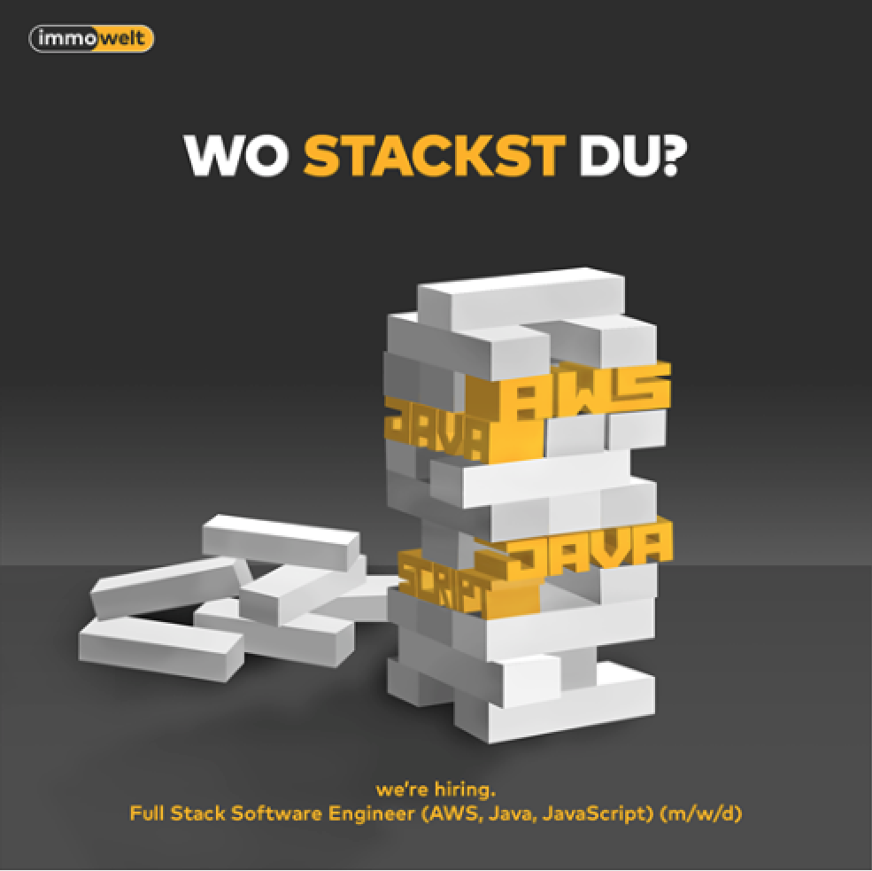
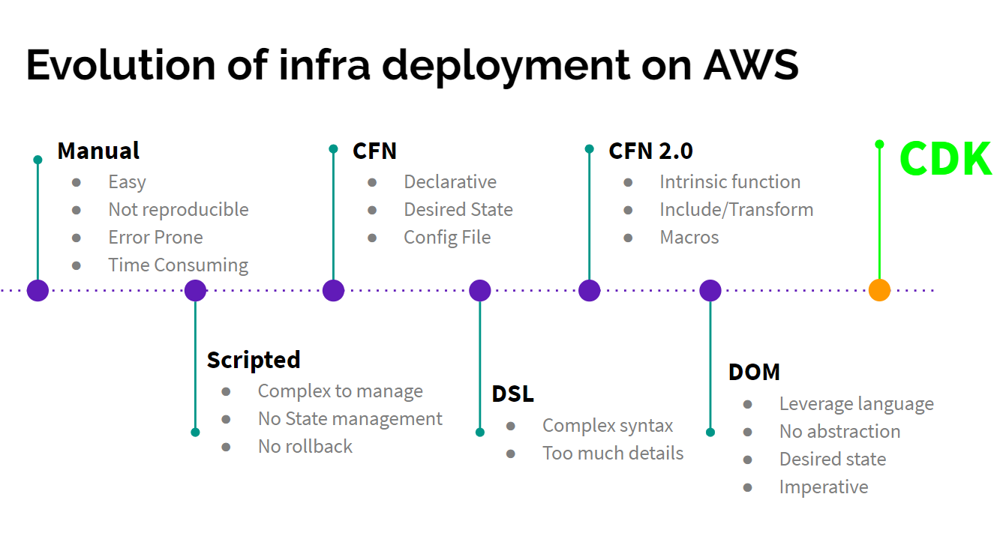
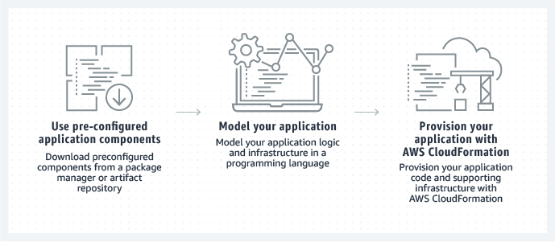
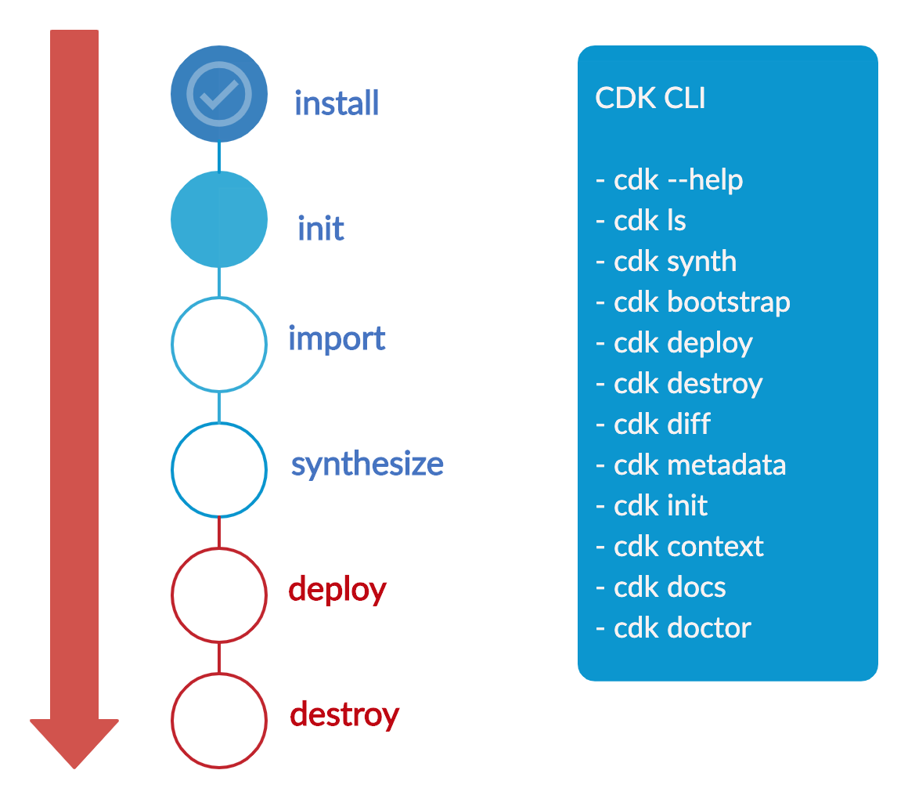
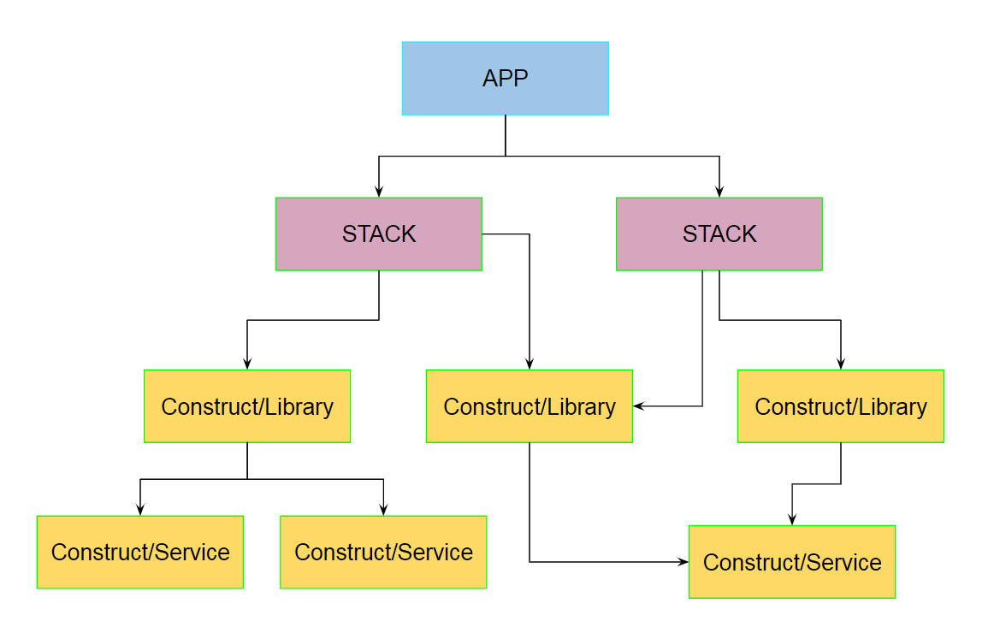
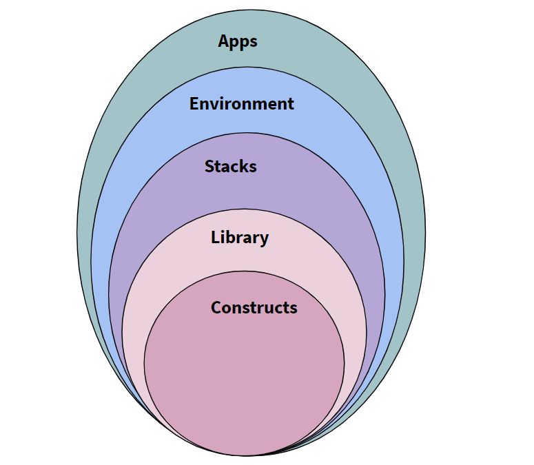

<!-- .slide: data-background="images/background/aws-cdk-ga.jpg" -->

Note: 

<!--horizontal_slide-->

<!-- .slide: data-background="white" -->



<!--vertical_slide-->

<!-- .slide: data-background="white" -->


[https://bit.ly/387MHF0](https://bit.ly/387MHF0)

<!--horizontal_slide-->

## Agenda

* Warum Infrastruktur mit Code?
* Was gibt es bereits für AWS?
* Prinzip, Lifecycle, Projektaufbau
* Setup, Demos
* Testen
* Weitere Werkzeuge
* Konstruktbibliotheken
* Ausblick

<!--horizontal_slide-->

## Infrastructure

Warum Infrastruktur <del>as</del> with Code?

Note: Intention, Thoughtworks Tech Radar notes about handwritten Cfn

<!--horizontal_slide-->


Note: Erwartung und AWS Angebote

<!--vertical_slide-->

## Werkzeuge

Was gibt es bereits für AWS?

* Pulumi
* Troposhere
* Sceptre
* Cfn Modules
* ...

Note: From Troposphere to Pulumi, Python-based tools, Cfn modularizers, multi-cloud tools

<!--vertical_slide-->



<!--horizontal_slide-->

Was ist AWS CDK?

AWS Cloud Development Kit ist ein Open-Source-Framework für die Softwareentwicklung.
Damit lässt sich Cloud-Infrastruktur als Code mit modernen Programmiersprachen definieren und über AWS Cloudformation bereitstellen.
>

<!--horizontal_slide-->

## Funktionsprinzip



<!--vertical_slide-->

Erwartete Qualität & AWS Abdeckung


<!--vertical_slide-->

Aktueller Zustand (stabil) & Abdeckung (teilweise)


<!--horizontal_slide-->

## Lebenszyklus



<!--horizontal_slide-->

## Projektaufbau



<!--vertical_slide-->



<!--horizontal_slide-->

## Setup

<!--horizontal_slide-->

## Demos

<!--vertical_slide-->

## Demo: Polyglotte blueprints

<!--horizontal_slide-->

## Demo: SPA deployment auf AWS S3

Eine Vue.js App mit API-Zugriff

<!--horizontal_slide-->

## Testing

<!--horizontal_slide-->

## Tools

* Frag 1 <!-- .element: class="fragment" -->
* Frag 2 <!-- .element: class="fragment" -->

<!--vertical_slide-->

## Tool: Disassembler cdk-dasm

* Cloudformation Disassembler
* Generate code from Cfn Teamplates
* Not recommended, useful to get started
* [NPM Package cdk-asm](https://npmjs.com/package/cdk-dasm)
  
```bash
cdk-dasm < any-stack-template.json > any-stack.ts
```

<!--vertical_slide-->

## Tool: AWS Jsii

* Deliver polyglot libraries from a single codebase
* Typescript
* [Github AWS Jsii](https://github.com/aws/jsii)

```bash
npm init -y
npm i --save-dev jsii jsii-pacmak
# now configure package.json for polyglot output
npm run build
npm run package
```

<!--horizontal_slide-->

## AWS Construct Library

AWS CDK-Konstrukte werden in der AWS Construct Library bereitgestellt.

Sie sind Abstrahierungen von Cloud-Infrastrukturlogik.

Konstrukte können lokal definiert oder in Paketmanagern wie npm, Maven, NuGet oder PyPI veröffentlicht und verteilt werden.

<!--horizontal_slide-->

## Ausblick

<!--horizontal_slide-->

<!-- .slide: data-background="images/background/shutterstock_1173155356.jpg" -->

Vielen Dank für Eure Aufmerksamkeit

* E-mail: klaus@pittig.de
* Twitter, Github: @jforge
