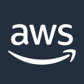
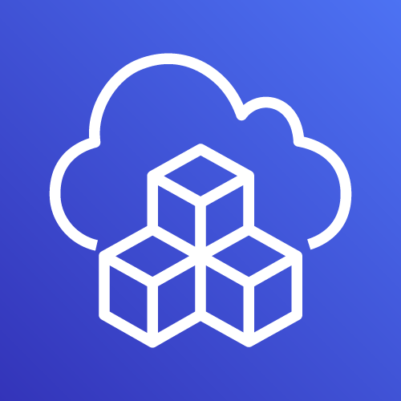
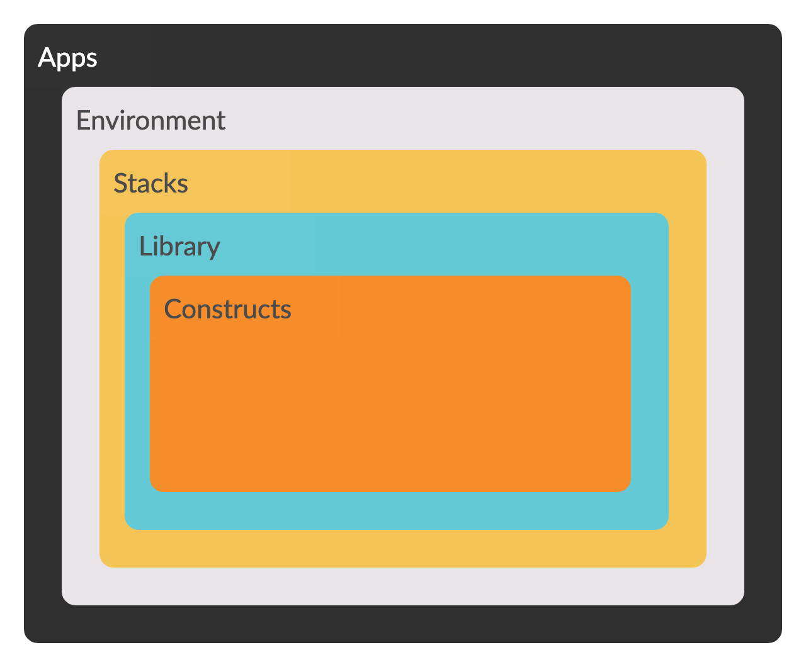
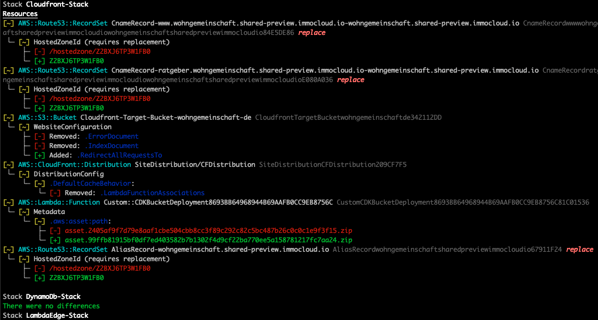
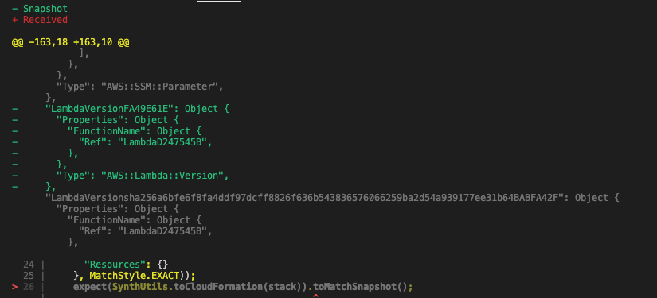

<!-- .slide: data-background="images/background/AWS-Cloud-Development-Kit-header.jpg" -->

AWS Cloud Development Kit <!-- .element: style="color:white" -->

 <!-- .element: style="background:none; border:none; box-shadow:none;" -->
 <!-- .element: style="background:none; border:none; box-shadow:none; width:20%; margin:20pt" -->
 <!-- .element: style="background:none; border:none; box-shadow:none; width:20%; margin:20pt" -->


<!--horizontal_slide-->

## Agenda

* Warum Infrastruktur mit Code? <!-- .element: class="fragment" -->
* Was gibt es bereits für AWS? <!-- .element: class="fragment" -->
* Prinzip, Lifecycle, Projektaufbau <!-- .element: class="fragment" -->
* Setup, Demos <!-- .element: class="fragment" -->
* Testing, Continuous Integration <!-- .element: class="fragment" -->
* Learnings <!-- .element: class="fragment" -->
* Weitere Werkzeuge <!-- .element: class="fragment" -->
* Construct Library <!-- .element: class="fragment" -->
* Ausblick <!-- .element: class="fragment" -->

<!--horizontal_slide-->

## Infrastructure

Warum Infrastruktur <del>as</del> with Code?

* Cloud App + Infrastruktur in bevorzugter Sprache <!-- .element: class="fragment" -->
* Hohe Abstraktion vermeidet wachsende Deskriptoren mit steigender Komplexität <!-- .element: class="fragment" -->
* Keine markup-artiges Yaml, Json or low-level provider-spezifische Template Sprache <!-- .element: class="fragment" -->
* Geringere Wahrscheinlichkeit von Kopien statt Wiederverwendung (komplexer Infrastruktur) <!-- .element: class="fragment" -->
* AWS Cross Region Bedarf für eine Anwendung mit Logik und Multi-Stacks einfach zu decken <!-- .element: class="fragment" -->

Note: Intention, Thoughtworks Tech Radar notes about handwritten Cfn, Terraform HCL 2.0 multi cloud provider fähig, Modularisierungskonzepte übertragbar, vermeidet Architektur-Fehler wie De-Isolation und operative Zentralisierung (Z.B. alle Zertifikate zentral verwaltet, Feature-Team hat keine Hoheit)

<!--vertical_slide-->

## Weitere Vorteile (AWS CDK)

* Logik (if, for-loops etc.) zur Infrastrukturdefinition <!-- .element: class="fragment" -->
* Objektorientierte Techniken zur Modellierung <!-- .element: class="fragment" -->
* Teilen und Wiederverwenden von Komponenten/Bibliotheken  <!-- .element: class="fragment" -->
* Organisation von Projekten in logisch-fachliche Module  <!-- .element: class="fragment" -->
* Testing von Infrastruktur-Code mit Standardmittel  <!-- .element: class="fragment" -->
* Bestehende Code Review Workflows nutzbar  <!-- .element: class="fragment" -->
* Code Completion in der IDE  <!-- .element: class="fragment" -->

<!--vertical_slide-->

## (Mögliche) Nachteile

* Neues SDK/API, ggf. mit unvollständiger Abdeckung des Cloud Ressourcen. <!-- .element: class="fragment" -->
* Modularisierungskonzepte eventuell nicht übertragbar. <!-- .element: class="fragment" -->
* Development Kit nicht auf andere Provider übertragbar. <!-- .element: class="fragment" -->
* Akzeptanz bei versierten Terraformern und Serverless/SAM Nutzern (DevOps) <!-- .element: class="fragment" -->

<!--horizontal_slide-->


Note: Erwartung und AWS Angebote

<!--horizontal_slide-->

## Werkzeuge

Was gibt es bereits für AWS?

* Mit gewohnten Programmiersprachen:
  * Pulumi (multi cloud, polyglott) <!-- .element: class="fragment" -->
  * Troposhere, Sceptre (Python) <!-- .element: class="fragment" -->
  * ...? <!-- .element: class="fragment" -->
* Deklarativ, ohne Programmiersprachen:
  * Cloudformation, Serverless, SAM <!-- .element: class="fragment" -->
  * Cfn Modules, Stacker, Stack Deployment Tool<!-- .element: class="fragment" -->
  * Terraform  <!-- .element: class="fragment" -->
  * ...?  <!-- .element: class="fragment" -->

Note: From Troposphere to Pulumi, Python-based tools, Cfn modularizers, multi-cloud tools

<!--vertical_slide-->


<!--horizontal_slide-->

Was ist AWS CDK?

* AWS Cloud Development Kit ist ein Open-Source-Framework für die Softwareentwicklung <!-- .element: class="fragment" -->
* Damit wird Cloud-Infrastruktur als Code mit modernen Programmiersprachen definiert und über AWS Cloudformation bereitgestellt <!-- .element: class="fragment" -->
* Unterstütze Sprachen: TypeScript, JavaScript, Python, Java, and .NET (C#, F#) <!-- .element: class="fragment" -->
* Entwickler erstellen in ihrer Sprache wiederverwendbare Komponenten (Constructs) und führen sie in Stacks und Apps zusammen <!-- .element: class="fragment" -->

<!--horizontal_slide-->

## Funktionsprinzip


<!--vertical_slide-->

Erwartete Qualität & AWS Abdeckung

 <!-- .element: width="80%" -->

<!--vertical_slide-->

Aktueller Zustand (stabil) & Abdeckung (teilweise)

 <!-- .element: width="80%" -->

<!--horizontal_slide-->

## Lebenszyklus

 <!-- .element: width="60%" -->

<!--horizontal_slide-->

## Projektüberblick

<!-- .slide: data-background="white" -->

 <!-- .element: style="background; border:none; box-shadow:none;" -->

<!--horizontal_slide-->

## Projekthierarchie

 <!-- .element: width="80%" -->

<!--vertical_slide-->

## Projekthierarchie

* App - Projektursprung, stellt Stacks bereit <!-- .element: class="fragment" -->
  * Environment - Multi-Account, Multi-Region <!-- .element: class="fragment" -->
* Stack - Bereitstellbare Einheit einer CDK App <!-- .element: class="fragment" -->
* Construct - AWS Resource Repräsentation <!-- .element: class="fragment" -->
  * High Level (Bibliothek wie VPC oder CustomResource) <!-- .element: class="fragment" -->
  * Low level (CfnResources) wie Subnets, Gateways etc. <!-- .element: class="fragment" -->

<!--vertical_slide-->

## Projekthierarchie

<!-- .slide: data-background="white" -->

 <!-- .element: style="background; border:none; box-shadow:none; width:70%" -->

<!--horizontal_slide-->

## Setup

* AWS CLI und ein oder mehrere AWS Profile <!-- .element: class="fragment" -->
* Node.js > 10.3.0 (für alle Sprachen, JS Bindings) <!-- .element: class="fragment" -->
* AWS CDK <!-- .element: class="fragment" -->
  * Ref: [Getting started with CDK](https://docs.aws.amazon.com/de_de/cdk/latest/guide/getting_started.html)

```bash
npm install -g aws-cdk
cdk --version
```

<!--horizontal_slide-->

## Demos

* Polyglot Blueprints <!-- .element: class="fragment" -->
* CDK synth, deploy, diff, destroy <!-- .element: class="fragment" -->
* Sample Stack: API Cors Lambda Crud DynamoDb <!-- .element: class="fragment" -->
* Amplify App from Github <!-- .element: class="fragment" -->
* Vue.js SPA Deployment to S3 <!-- .element: class="fragment" -->
* Sprachsynthesis App with Amazon Polly <!-- .element: class="fragment" -->
* Brand new: CDK Watchful Construct Library <!-- .element: class="fragment" -->

<!--vertical_slide-->

## Polyglotte blueprints

* Aktuelle Sprachbibliotheken und Lifecycle/Dependency Manager
  
```
mkdir demo && cd demo
cdk init sample-app language=typescript
npm install
npm run build && npm run test
```

```bash
mkdir demojava && cd demojava
cdk init lib language=java
mvn package
```

<!--vertical_slide-->

## CDK Synthese und Deployment

```bash
cdk ls
cdk synth
cdk deploy
cdk diff
cdk destroy
```

```bash
cdk synth '*' --profile any-profile-name
```

```bash
cdk synth StackOne StackTwo
```

<!--vertical_slide-->

## Sample: CDK MultiStack Diff



<!--horizontal_slide-->

## Demo: Sample Stack on Github

[API-Cors-Lambda-Crud-DynamoDb Sample](https://github.com/aws-samples/aws-cdk-examples/blob/master/typescript/api-cors-lambda-crud-dynamodb/index.ts)

<!--vertical_slide-->

## Demo: Amplify Console App

[Amplify Console App](https://github.com/aws-samples/aws-cdk-examples/tree/master/typescript/amplify-console-app): Deploy a static site from Github

[AWS Amplify](https://aws.amazon.com/de/amplify/console/): Hosting for full stack serverless web apps with continuous deployment

<!--vertical_slide-->

## Demo: SPA deployment to AWS S3

[Eine Vue.js App mit API-Zugriff](http://gcme-search.s3-website.eu-central-1.amazonaws.com/)

<!--vertical_slide-->

## Demo: Sprachsynthesis App with Amazon Polly

[Build a Text to Speech App with Amazon Polly](https://aws.amazon.com/de/blogs/machine-learning/build-your-own-text-to-speech-applications-with-amazon-polly/)

<!--vertical_slide-->

## Demo: CDK Watchful 

Monitor CDK Apps

[Github -> CDK Watchful](https://awscdk.io/packages/cdk-watchful@0.4.3/#/./cdk-watchful-readme)

<!--horizontal_slide-->

## Testing

Sample: Jest mit Snapshots

```js
describe('New DynamoDb Resource can be setup', () => {
  test('Synthesized Stack matches snapshot', () => {
    const stack = prepareTestStack(new cdk.App());
    expectCDK(stack).notTo(matchTemplate({
      "Resources": {}
    }, MatchStyle.EXACT));
    expect(SynthUtils.toCloudFormation(stack)).toMatchSnapshot();
  });
  test('BillingMode is Pay_per_request', () => {
    const stack = prepareTestStack(new cdk.App());
    expectCDK(stack).to(haveResource("AWS::DynamoDB::Table", {
      BillingMode: "PAY_PER_REQUEST"
    }));
  });
}o
```

<!--vertical_slide-->

## Testing

Sample: Snapshot Test Result




<!--horizontal_slide-->

## CI/CD Pipeline - Jenkins CDK Deployment

```groovy
stage('AWS CDK synthesis & deployment'){
  agent { docker {
      image 'robertd/alpine-aws-cdk'
      args '-it -v $WORKSPACE:/app -w /app'
  } }
  steps {
    withCredentials([file(credentialsId: 'PROFILES', 
                          variable: 'CREDENTIALS_FILE')]) {
      script {
        sh "cdk --app 'npx ts-node bin/edge-multi-stack.ts'
                synth '*'"
        sh "cdk --app 'npx ts-node bin/edge-multi-stack.ts'
                deploy Route53-Stack LambdaEdge-Stack Cloudfront-Stack"
      }
    }
  }
}
```

<!--vertical_slide-->

## CI/CD Pipeline - CDK Bootstrapping

```groovy
script {
  bootStrapUsEast1 = sh(returnStdout: true, script:
     "cdk bootstrap aws://${accountIdDev}/us-east-1")
  bootStrapEuCentral1 = sh(returnStdout: true, script:
     "cdk bootstrap aws://${accountIdDev}/eu-central-1")
  }
```

<!--horizontal_slide-->

## Learnings

* Thoughtworks hat recht (vermeide händische Cloudformation Vorlagen)  <!-- .element: class="fragment" -->
* Steile Lernkurve, schnelle Einarbeitung  <!-- .element: class="fragment" -->
* Bequemes Arbeiten z.B. mit TypeScript <!-- .element: class="fragment" -->
* Keine Hürden für sauberes Testen <!-- .element: class="fragment" -->
* Staging, Cross Region und Cross Account Deployments inkl. CI/CD pipeline möglich. <!-- .element: class="fragment" -->
* Nutze Docker Container mit AWS SDK, CDK und Typescript Toolstack <!-- .element: class="fragment" -->
* und mehr... <!-- .element: class="fragment" -->

Note: https://github.com/robertd/alpine-aws-cdk

<!--vertical_slide-->

## Even more learnings

* Bessere Mikroarchitektur durch Unit-Tests und Multistack Deployment <!-- .element: class="fragment" -->
* MultiStack mit Route53, ACM, Cloudfront, Lambda@Edge + DynamoDB war erfolgreich <!-- .element: class="fragment" -->
* CDK für CloudFront mit Lambda@Edge ggf. problematisch <!-- .element: class="fragment" -->
  * Lambda Assoziationen und Löschungen<!-- .element: class="fragment" -->
  * Timing <!-- .element: class="fragment" -->
  * Cloudfront Konstrukt teilweise zu unflexibel  <!-- .element: class="fragment" -->
  * Nicht alles Cross-stack modularisierbar  <!-- .element: class="fragment" -->

Note: Lambda@Edge issues - timing with cert validation, route53 Alias Record, cloudfront deployment, deletion, NestedStacks only with clearly dependent stacks, best with one (custom) construct resource.

<!--horizontal_slide-->

## Weitere Werkzeuge

* Disassembler cdk-dasm (experimentell) <!-- .element: class="fragment" -->
* AWS Jsii (stabil, CDK Kern-Tool) <!-- .element: class="fragment" -->
* Docker Container zur Arbeit mit CDK <!-- .element: class="fragment" -->

<!--vertical_slide-->

## Disassembler cdk-dasm

* [Cloudformation Disassembler](https://github.com/aws/aws-cdk/tree/master/packages/cdk-dasm)
* Erzeugt Typescript code aus Cfn Templates
* Experimentell, nicht empfohlen für Produktivsysteme
* Nützlich zum Starten mit CDK
* [NPM Package cdk-asm](https://npmjs.com/package/cdk-dasm)
  
```bash
cdk-dasm < any-stack-template > any-stack.ts
```

<!--vertical_slide-->

## AWS Jsii

* Produktion polyglotter CDK Bibliotheken aus einer Codebase (TypeScript)
* [Github AWS Jsii](https://github.com/aws/jsii)


```bash
npm init -y
npm i --save-dev jsii jsii-pacmak
# now configure package.json for polyglot output
npm run build
npm run package
```

<!--vertical_slide-->

## Docker Container

* Es gibt diverse Docker Container für die Arbeit mit AWS CDK
  * z.B. [Docker Image - Alpine-AWS-CDK](https://github.com/robertd/alpine-aws-cdk)
* Zusätzliche Werkzeuge für eine Umgebung mit Node.js und TypeScript
  * z.B. [Docker Image - Node-NPX-TypeScript](https://github.com/jforge/docker-node-npx-typescript)
  
<!--horizontal_slide-->

## AWS Construct Library

* Konstrukte bereitgestellt in AWS Construct Library, abstrahiert Cloud-Infrastrukturlogik<!-- .element: class="fragment" -->
* Für alle Sprachen ist eine JS Runtime erforderlich <!-- .element: class="fragment" -->
* Lokale Definition oder via Paket Manager <!-- .element: class="fragment" -->
* [AWS CDK Construct Library](https://docs.aws.amazon.com/cdk/api/latest/docs/aws-construct-library.html)
  * Stabil: [AWS Lambda](https://docs.aws.amazon.com/cdk/api/latest/docs/aws-lambda-readme.html) <!-- .element: class="fragment" -->
  * Experimentell: [AWS Kinesis](https://docs.aws.amazon.com/cdk/api/latest/docs/aws-kinesis-readme.html)  <!-- .element: class="fragment" -->
* Alternative Konstrukte <!-- .element: class="fragment" -->
  * z.B. [Destroyable Bucket](https://github.com/NightWatchman/destroyable-bucket)  <!-- .element: class="fragment" -->

<!--horizontal_slide-->

## Weitere Ressourcen

* [AWS CDK](https://github.com/aws/aws-cdk)
* [CDK Workshop](https://cdkworkshop.com/)
* [g aws cdk blog](https://www.google.com/search?q=aws+cdk+blog)
* ...
  
<!--horizontal_slide-->

## Ausblick

* [Aktuelles Release](https://github.com/aws/aws-cdk/releases/)
* CDK ist stabil und nutzbar <!-- .element: class="fragment" -->
* Einige Konstrukte sind noch experimentell <!-- .element: class="fragment" -->
* Es gibt ein Angebot an 3rd Party Konstrukten (z.B. DestroyableBucket) <!-- .element: class="fragment" -->
* Ökosystem, Stabilität & Abdeckung wachsen <!-- .element: class="fragment" -->
* Multi-Cloud Tools wie Pulumi sind eine Alternative  <!-- .element: class="fragment" -->
* aber...
* ...zur Produktion würde ich noch Terraform bevorzugen<!-- .element: class="fragment" -->

<!--horizontal_slide-->

<!-- .slide: data-background="images/background/shutterstock_1173155356.jpg" -->

Vielen Dank für Eure Aufmerksamkeit

* E-mail: klaus@pittig.de
* Twitter, Github: @jforge
