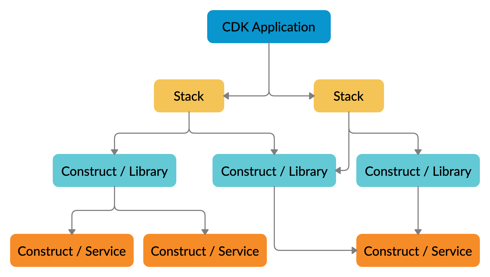

<!-- .slide: data-background="images/background/aws-cdk-ga.jpg" -->

<!--horizontal_slide-->

<!-- .slide: data-background="white" -->


Note: Die Immowelt Hamburg GmbH gehört mit der Immowelt AG zur Immowelt Gruppe, 
einer 100%igen Axel Springer Tochter.
Wir arbeiten als Spezialisten für die digitale Immobilienvermarktung an der Weiterentwicklung der reichweitenstarken Immobilienportale immonet.de und immowelt.de, 
und erschaffen zurzeit die nächste Plattform-Generation. Darüber hinaus betreibt Immowelt Portale wie bauen.de und umzugsauktion.de und bietet eine CRM-Software für die Immobilienwirtschaft an.

Wir suchen motivierte, erfahrene und talentierte Mitarbeiter, die an die Chancen von Cloud Computing, Data Science und Mobile Apps glauben und neuartige Technologien verwenden und mitgestalten wollen.
Im Umfeld der AVIV Gruppe als habt Ihr auch die Chance, international mitzuarbeiten.

Englisch

Immowelt Hamburg together with Immowelt Corp. is part of Immowelt Group, a 100% affiliate of Axel Springer. 
As specialists for the digital real estate marketing we are working on the advancement of the wide-coverage real estate portal immonet.de and immowelt.de, and are currently creating the next generation platform. 
Beyond that Immowelt runs portals like bauen.de and umzugsauktion.de,
and offers a CRM software for the real estate industry.

We are looking for motivated, experienced and talented employees believing in the odds of 
cloud computing, data science and mobile apps, and want to use and help shape new technologies.
In context of the AVIV group you also have the chance to work internationally.


<!--vertical_slide-->

<!-- .slide: data-background="white" -->


https://bit.ly/387MHF0

Our Tech Stack:

https://stackshare.io/immowelt-group/immowelt-hamburg-gmbh


<!--horizontal_slide-->

## Agenda

* Warum Infrastruktur mit Code? <!-- .element: class="fragment" -->
* Was gibt es bereits für AWS? <!-- .element: class="fragment" -->
* Prinzip, Lifecycle, Projektaufbau <!-- .element: class="fragment" -->
* Setup, Demos <!-- .element: class="fragment" -->
* Testen <!-- .element: class="fragment" -->
* Weitere Werkzeuge <!-- .element: class="fragment" -->
* Konstruktbibliotheken <!-- .element: class="fragment" -->
* Ausblick <!-- .element: class="fragment" -->


<!--horizontal_slide-->

## Infrastructure

Warum Infrastruktur <del>as</del> with Code?

Note: Intention, Thoughtworks Tech Radar notes about handwritten Cfn

<!--horizontal_slide-->


Note: Erwartung und AWS Angebote

<!--vertical_slide-->

## Werkzeuge

Was gibt es bereits für AWS?

* Pulumi
* Troposhere
* Sceptre
* Cfn Modules
* ...

Note: From Troposphere to Pulumi, Python-based tools, Cfn modularizers, multi-cloud tools

<!--vertical_slide-->


<!--horizontal_slide-->

Was ist AWS CDK?

AWS Cloud Development Kit ist ein Open-Source-Framework für die Softwareentwicklung.
Damit lässt sich Cloud-Infrastruktur als Code mit modernen Programmiersprachen definieren und über AWS Cloudformation bereitstellen.

<!--horizontal_slide-->

## Funktionsprinzip


<!--vertical_slide-->

Erwartete Qualität & AWS Abdeckung


<!--vertical_slide-->

Aktueller Zustand (stabil) & Abdeckung (teilweise)


<!--horizontal_slide-->

## Lebenszyklus


<!--horizontal_slide-->

## Projektaufbau



<!--vertical_slide-->


<!--horizontal_slide-->

## Setup

* Installiere AWS CLI und konfiguriere eine AWS Umgebung <!-- .element: class="fragment" -->
* Installiere AWS CDK <!-- .element: class="fragment" -->
  * Ref: [Getting started with CDK](https://docs.aws.amazon.com/de_de/cdk/latest/guide/getting_started.html)
  * ```bash
brew install aws-cdk
npm i aws-cdk
```


<!--horizontal_slide-->

## Demos

<!--vertical_slide-->

## Demo: Polyglotte blueprints

```bash
cdk init sample-app language=typescript
```

```bash
cdk init lib language=java
```

<!--vertical_slide-->

## Demo: ...

[API-Cors-Lambda-Cru-DynamoDb Sample](https://github.com/aws-samples/aws-cdk-examples/blob/master/typescript/api-cors-lambda-crud-dynamodb/index.ts)

### Cloudformation synthesis

```bash
cdk synth '*' --profile iw-shared-dev
```

To synthesize single or a group of stacks in this environment for testing purposes:

```bash
cdk synth Route53Stack --profile iw-shared-dev
```

```bash
cdk synth Route53Stack DynamoDBStack --profile iw-shared-dev
```

### MultiStack Cloudformation deployment

```bash
cdk deploy '*' --profile iw-shared-dev
```

### Cloudformation takedown

To destroy the multistack in case of cleanup or any issues:

```bash
cdk destroy '*' --profile iw-shared-dev
```


<!--vertical_slide-->

## Demo: SPA deployment auf AWS S3

[Eine Vue.js App mit API-Zugriff](http://gcme-search.s3-website.eu-central-1.amazonaws.com/)

<!--horizontal_slide-->

## Testing

Beispiel Jest mit Snapshots

```js
describe('New DynamoDb Resource can be setup', () => {

  test('Synthesized Stack matches snapshot', () => {
    const app = new cdk.App();
    // WHEN
    const stack = prepareTestStack(app);
    // THEN
    expectCDK(stack).notTo(matchTemplate({
      "Resources": {}
    }, MatchStyle.EXACT));
    expect(SynthUtils.toCloudFormation(stack)).toMatchSnapshot();
  });

  test('BillingMode is Pay_per_request', () => {
    const app = new cdk.App();
    // WHEN
    const stack = makeTestStack(app);
    // THEN
    expectCDK(stack).to(haveResource("AWS::DynamoDB::Table", {
      BillingMode: "PAY_PER_REQUEST"
    }));
  });
}
```

<!--horizontal_slide-->

## CI/CD Pipeline

Beispiel Jenkins-CI

```groovy
stage('DEV - AWS CDK synthesis & deployment'){
  agent {
    docker {
      image 'robertd/alpine-aws-cdk'
      args '-it -v $WORKSPACE:/app -w /app'
      reuseNode true
    }
  }
  environment { 
    AWS_PROFILE = "any-profile-dev"
    DEPLOY_STAGE = "dev"
  }
  steps {
    withCredentials([file(credentialsId: 'AWS_ANY_PROFILES', variable: 'AWS_ANY_CREDENTIALS_FILE')]) {
      script {
        cdkVersion = sh(returnStdout: true, script: 'cdk --version')
        echo "CDK Version: ${cdkVersion}"
        sh "cd infrastructure && cdk --app 'npx ts-node bin/lambda-edge-multi-stack.ts' synth '*'"
        sh "cd infrastructure && cdk --app 'npx ts-node bin/lambda-edge-multi-stack.ts' deploy Route53-Stack LambdaEdge-Stack DynamoDb-Stack Cloudfront-Stack"
      }
    }
  }
}
```

<!--vertical_slide-->

## CI/CD Pipeline

Beispiel Jenkins-CI - CDK Bootstrapping 

```groovy
script {
  bootStrapUsEast1 = sh(returnStdout: true, script: "cdk bootstrap aws://${accountIdDev}/us-east-1")
  echo "CDK Bootstrap: ${bootStrapUsEast1}"
  bootStrapEuCentral1 = sh(returnStdout: true, script: "cdk bootstrap aws://${accountIdDev}/eu-central-1")
  echo "CDK Bootstrap: ${bootStrapEuCentral1}"
  }
```

<!--horizontal_slide-->

## Learnings

* Thoughtworks hat recht (vermeide händische Cloudformation Vorlagen)  <!-- .element: class="fragment" -->
* Steile Lernkurve, schnelle Einarbeitung  <!-- .element: class="fragment" -->
* Bequemes Arbeiten mit TypeScript für AWS Infrastruktur  <!-- .element: class="fragment" -->
* Keine Hürden für sauberes Testen <!-- .element: class="fragment" -->
* Staging, Cross Region und Cross Account deployments inkl. CI/CD pipeline möglich. <!-- .element: class="fragment" -->
* Nutze Docker Container mit AWS SDK, CDK und Typescript toolstack <!-- .element: class="fragment" -->
* und mehr... <!-- .element: class="fragment" -->

Note: https://github.com/robertd/alpine-aws-cdk


<!--vertical_slide-->

## Even more learnings

* Bessere Mikroarchitektur durch Unit-Tests und Multistack Deployment <!-- .element: class="fragment" -->
* MultiStack mit Route53, ACM, Cloudfront, Lambda@Edge + DynamoDB war erfolgreich <!-- .element: class="fragment" -->
* CDK für CloudFront mit Lambda@Edge ggf. problematisch <!-- .element: class="fragment" -->
  * Lambda Assoziationen und Löschungen<!-- .element: class="fragment" -->
  * Timing <!-- .element: class="fragment" -->
  * Cloudfront Konstrukt teilweise zu unflexibel  <!-- .element: class="fragment" -->
  * Nicht alles Cross-stack modularisierbar  <!-- .element: class="fragment" -->

Note: Lambda@Edge issues - timing with cert validation, route53 Alias Record, cloudfront deployment, deletion, NestedStacks only with clearly dependent stacks, best with one (custom) construct resource.


<!--horizontal_slide-->

## Tools

* Disassembler cdk-dasm (experimental) <!-- .element: class="fragment" -->
* AWS Jsii <!-- .element: class="fragment" -->

<!--vertical_slide-->

## Tool: Disassembler cdk-dasm

* [Cloudformation Disassembler](https://github.com/aws/aws-cdk/tree/master/packages/cdk-dasm)
* Generates Typescript code from Cfn Templates
* Experimental, not recommended for production
* Useful to get started with CDK
* [NPM Package cdk-asm](https://npmjs.com/package/cdk-dasm)
  
```bash
cdk-dasm < any-stack-template > any-stack.ts
```

<!--vertical_slide-->

## Tool: AWS Jsii

* Deliver polyglot libraries from a single codebase
* Typescript
* [Github AWS Jsii](https://github.com/aws/jsii)

```bash
npm init -y
npm i --save-dev jsii jsii-pacmak
# now configure package.json for polyglot output
npm run build
npm run package
```

<!--horizontal_slide-->

## AWS Construct Library

AWS CDK-Konstrukte werden in der AWS Construct Library bereitgestellt.

Sie sind Abstrahierungen von Cloud-Infrastrukturlogik.

Konstrukte können lokal definiert oder in Paketmanagern wie npm, Maven, NuGet oder PyPI veröffentlicht und verteilt werden.

* [AWS CDK Construct Library] <!-- .element: class="fragment" -->
  * Stabil: [AWS Lambda](https://docs.aws.amazon.com/cdk/api/latest/docs/aws-lambda-readme.html) <!-- .element: class="fragment" -->
  * Experimentell: [AWS Kineses](https://docs.aws.amazon.com/cdk/api/latest/docs/aws-kinesis-readme.html)  <!-- .element: class="fragment" -->
* Alternative Konstrukte <!-- .element: class="fragment" -->
  * z.B. [Destroyable Bucket](https://github.com/NightWatchman/destroyable-bucket)  <!-- .element: class="fragment" -->

<!--horizontal_slide-->

## Ausblick

* Aktuell: Version 1.20 <!-- .element: class="fragment" -->
* CDK ist stabil und nutzbar <!-- .element: class="fragment" -->
* Einige Konstrukte sind noch experimentell <!-- .element: class="fragment" -->
* Es gibt ein Angebot an 3rd Party Konstrukten (z.B. DestroyableBucket) <!-- .element: class="fragment" -->
* Das Ökosystem wächst <!-- .element: class="fragment" -->
* Multi-Cloud Tools wie Pulumi sind eine Alternative  <!-- .element: class="fragment" -->
* und mehr... <!-- .element: class="fragment" -->
* ... ich würde zurzeit noch Terraform bevorzugen <!-- .element: class="fragment" -->

<!--horizontal_slide-->

<!-- .slide: data-background="images/background/shutterstock_1173155356.jpg" -->

Vielen Dank für Eure Aufmerksamkeit

* E-mail: klaus@pittig.de
* Twitter, Github: @jforge
